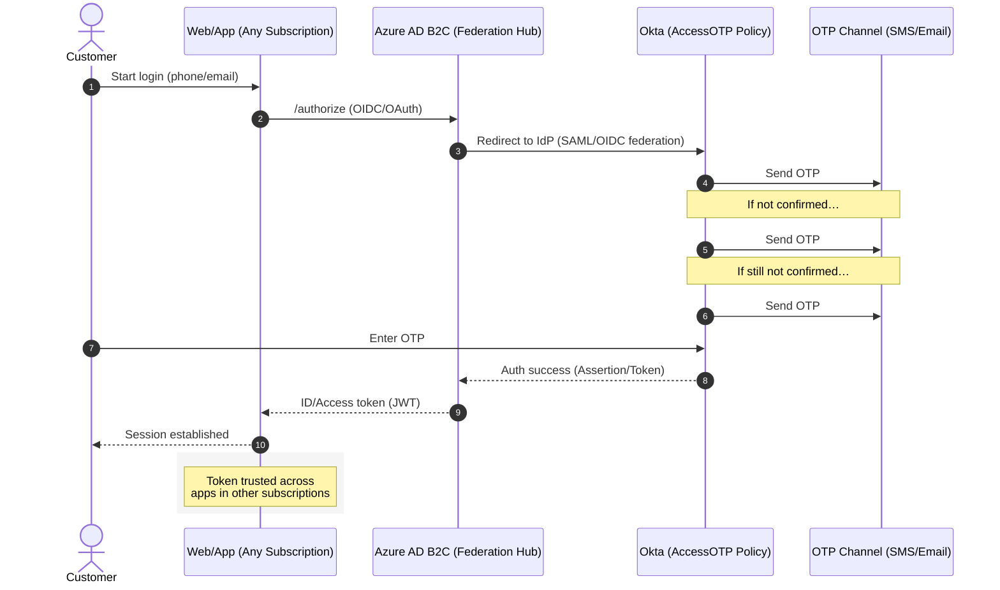

# cross-subscription-passwordless-auth

## Problem Statement
Traditional authentication flows required customers to create and remember user IDs and passwords. This led to **friction, poor adoption rates, and higher support costs**. The organization needed a **secure, passwordless authentication mechanism** that would:
- Simplify the customer login experience.
- Work seamlessly across multiple applications and subscriptions.
- Stay compliant with security and industry standards.

---

## Solution — AccessOTP
**AccessOTP** is an **OTP-based authentication flow** integrated with **Azure AD B2C** and **Okta**.

### Key Features
- **OTP login** instead of passwords.
- **Retry mechanism:** OTP sent 3 times — first after **30s**, then **1 min**, then **1.5 min**.
- **Federation:** Okta policies federated into Azure AD B2C.
- **Multi-application access:** Customers can log in once and seamlessly access apps across subscriptions.

---

## Architecture Overview
1. **Customer initiates login** → enters phone/email.  
2. **AccessOTP (Okta policy)** generates OTPs.  
3. **Retry sequence:** 30s → 1m → 1.5m.  
4. **Azure AD B2C** federates the authentication.  
5. **JWT tokens issued** → trusted by apps across multiple subscriptions.

---

## Benefits
- **Frictionless experience** — No password creation needed.
- **Passwordless security** — Eliminates weak/reused passwords.
- **Scalable** — Works across multiple apps/subscriptions.
- **Reusable** — New apps can be onboarded easily.
- **Standards-compliant** — Aligns with OAuth2, OIDC, and security requirements.

---

## Outcome
- Increased customer adoption due to simpler login.
- Improved reliability with OTP retry mechanism.
- Delivered a **modern identity framework** bridging Okta and Azure B2C.
- Positioned the platform toward **future-ready passwordless authentication**.

---

## Diagrams

### Sequence Diagram — AccessOTP Login Flow


### Component Diagram — AccessOTP Architecture
```mermaid
flowchart LR
    C[Customer] -->|Login| APP[App A - Sub X]
    C -->|Login| APP2[App B - Sub Y]
    APP -->|OIDC/OAuth| B2C[Azure AD B2C (Federation Hub)]
    APP2 -->|OIDC/OAuth| B2C

    B2C -->|Federation (SAML/OIDC)| OKTA[Okta (AccessOTP Policy)]
    OKTA -->|OTP Orchestration| OTP[(SMS or Email Provider)]

    subgraph Identity_Plane [Identity Plane]
      B2C
      OKTA
      OTP
    end

    subgraph App_Plane [App Plane]
      APP
      APP2
    end
```

---

## STAR Story — Bold Idea (AccessOTP)
**Situation:** The existing authentication flow required customers to create and remember credentials, causing friction and low adoption.  
**Task:** Propose a **secure, user-friendly, scalable** solution that integrates with Okta and Azure.  
**Action:** Designed **AccessOTP** (OTP-based login) with **Okta → Azure AD B2C federation**, including a **30s → 1m → 1.5m** OTP retry mechanism; tokens issued by B2C trusted across subscriptions.  
**Result:** Approved by leadership; delivered **frictionless login**, **reusable identity framework**, and improved adoption while aligning with **passwordless best practices**.

---

## Notes
> Make sure GitHub has **Mermaid diagrams enabled** (GitHub supports Mermaid in Markdown natively). If diagrams don’t render in your local preview, view them on GitHub.
